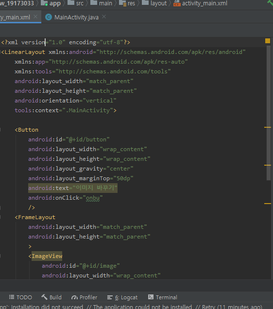

# 19173033임주리

## 2주차과제

## 3주차과제

##  4주차과제
<어플 아이디어 기획>
모바일 복권 - '뽀바복권'
@복권을 언제까지 대면구매할래?
@구입부터 ~ 당첨금수령까지 어플하나로 된다면?
@모바일 어플에서 번호를 pick, 자동으로 받을 수 있으며 
<내 복권>칸에서 모바일 복권 정보와 오프라인으로 구매한 복권 정보를 등록하여 한 번에 관리할 수 있다.
당첨번호알림을 알림push기능으로 알 수 있고, 당첨금 수령도 신분증과 공인인증서만 있다면 모바일로 가능하다.

## 7주차과제
emulator가 실행이 안돼서... 창이라도 캡쳐했습니다 ㅠㅠㅠ

## 9주차과제
응용문제가 실행이 잘 안돼서 ㅠㅠ.. 강의 때 진행한 거라두 올릴게요!

11-02 12:08am 구현 성공해서 수정해올립니다!!!!

## 10주차과제

## 11주차과제

